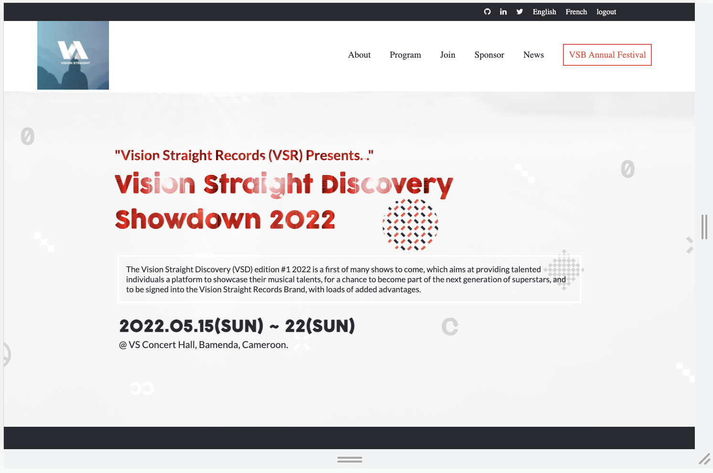

# THE VISION STRAIGHT DISCOVERY (VSD) SHOW

> This project is based on a fictitious musical talent event named above, organized by the Vision Straight Brothers (VSB) crew in Bamenda, Cameroon. This is to attest that I, Chia Carlyle, have completed the first module of the Microverse curriculum called, ***The Portal***.
Click the link in the `Live Demo` section to check it out.

## Built With

- HTML, CSS, Javascript.

## Live Demo

If you want to be redirected to the project site, click on [this link](https://carlylechia.github.io/Vision-Straight/)

## Getting Started

To get a local copy up and running follow these simple example steps.

### Prerequisites
You will need:
 - A laptop or tablet, preferably a laptop;
 - A browser installed like Chrome, Firefox, etc;
 - A text editor like installed Atom, VS-code, etc;
 - Terminal or commandline;
 - Internet connection.

### Setup, Install, and Usage
Follow these steps:
  - Create a folder in the local storage of your computer which will contain the repository;
  - open your browser and go to [the project's repository on github](https://github.com/carlylechia/Vision-Straight);
  - Click on the `code button` and copy the https link that is provided on the dropdown;
  - open terminal or commandline from the folder you created in the first step, and type in the command, "git clone " and then paste the url you copied on the previous step.
  - finally, you have the repository on your local computer storage. You can now open your text editor and import the repository to start making changes.

### Deployment
 
This project was deployed on github pages. [This is the link](https://carlylechia.github.io/Vision-Straight/).

### Documentation

I have recorded [a loom video](https://www.loom.com/share/8ac3176a9f0a4cf0b0cadfaacb2ca02b) briefly throwing some light on the project. Feel free to check it out.

## Authors

👤 **Author1**

- GitHub: [@carlylechia](https://github.com/carlylechia)
- Twitter: [@CarlyleChia](https://twitter.com/CarlyleChia)
- LinkedIn: [Chia Carlyle](https://linkedin.com/in/chia-carlyle)

## 🤝 Contributing

Contributions, issues, and feature requests are welcome!

Feel free to check the [issues page](https://github.com/carlylechia/Vision-Straight/issues). I will love to improve by solving the issues you raise.

## Show your support

Kindly give a ⭐️ if you like this project.

## Acknowledgments

- Hat tip to [Cindy Shin in Behance](https://www.behance.net/adagio07) for building the design template that was used in coding this project.
- I am grateful to @Microverseinc and their effective code review process for guiding me through the acquisition of the knowledge used in building this project.

## 📝 License

This project is [MIT](MIT.md) licensed.
